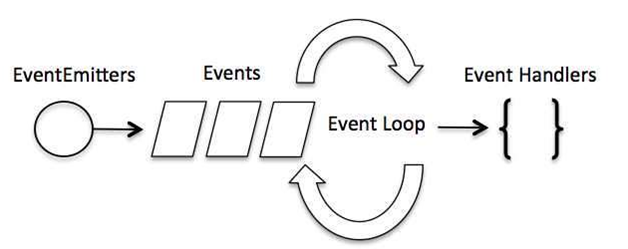

# Node.js project
We will explore Node.js fundamentals including modules such as `path`, `url`, `fs`, events and we will create an **HTTP server** from scratch without Express .

[Link][1] to video

### What is node?
- JavaScript Runtime - not a language or framework
- Uses V8 JavaScript engine (same as Google Chrome)
- Writen in C++
- It allows us to run JavaScript on the server side

### Why Node
- Fast, efficent and scalable
- Event driven and non-blocking I/O model
- Popularity
- Same language used in frontend

### What should we know first
- `HTTP` status codes, headers
- `JSON`
- Arrow Functions
- Promises
- MVC Patterns

### Node Event Loop
- Single threaded
- Supports concurrency via events and callbacks
- **EventEmitter** class is used to bind events and listeners

### Best types of projects for Node
- REST API and microservices
- Real time services (chat, live updates)
- CRUD apps (blog, shopping carts, social networks)
- Tools and utilities
- In short, anything that is not CPU intensive

### Node Package Manager - NPM
- Install 3rd party packages (frameworks, libraries, tools. etc)
- Packages get stored in `node_modules`
- Dependencies are installed in `package.json`
- NPM scripts can be configured to run certain tasks such as run a server
- Generate `package.json` file: `npm init`
- Install locally: `npm install express`
- Install globally: `npm install -g nodemon`

### Node modules
- Node Core Modules: `path`, `fs`, `http`.
  - `const path = require('path')`
- 3rd party modules or packages installed via NPM
  - `const abc = require('abc')`
- Custom modules created by the developer
  - `const myFile = require ('./myFile')`

## Project setup
1. `npm init`
2. `npm install uuid`
3. `npm install -D nodemon`

## Project modules
1. Created `index.js` file
2. Created `person.js` file 
3. Require `person.js` from `index.js`
4. Investigate Node Docs for `path` module
5. Investigate Node Docs for `fs` module
6. Investigate Node Docs for `os` module
7. Investigate Node Docs for `url` module
8. Investigate Node Docs for `events` module
9. Created a logger with `uuid` usage
10. Investigate Node Docs for `http` module

## Project implementation
1. Use environment variable for `http` server port
2. Modify `package.json` so that is has a `start` and `dev` script.
  - `npm run start`
  - `npm run dev`
3. Implement http server with `Home` and `About` sections

## Deploy project
- Simply run `npm install` and all dependencies will be installed from `package.json`

[1]: https://youtu.be/fBNz5xF-Kx4